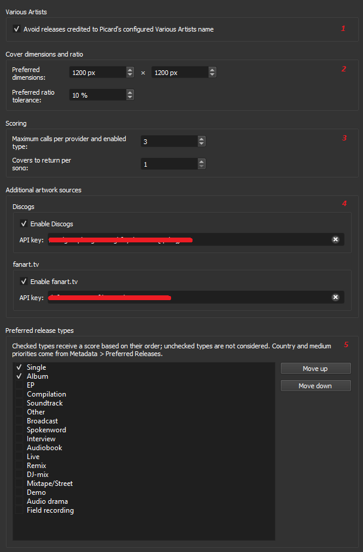

# Preferred Cover Art

Preferred Cover Art is a cover-art provider for MusicBrainz Picard 2.13. It
looks at the releases associated with the current recording, searches the
enabled artwork services, and returns the covers that best match your
preferences without replacing the release metadata already loaded in Picard.

Cover Art Archive is always enabled. fanart.tv and Discogs can be enabled
independently with their own API keys.

## How selection works

The plugin makes its choice in two stages. The first stage decides which
MusicBrainz releases are worth querying. The second compares the artwork found
for those releases.

### 1. Choosing releases to query

The plugin starts from the MusicBrainz recording ID of the loaded track and
finds every release containing that recording. If the loaded metadata has no
recording ID, it uses the first recording on the loaded release.

Candidates are then handled separately for every enabled release type. Singles
compete with singles, EPs with EPs, albums with albums, and so on. Within each
group, the plugin prefers:

1. releases closest to the recording's original release date;
2. releases whose track duration best matches the loaded track;
3. countries appearing highest in Picard's preferred-country list;
4. media appearing highest in Picard's preferred-format list.

The date is deliberately more important than the medium. A slightly less
preferred format will therefore not normally beat a substantially earlier and
more relevant release.

Only the strongest releases in each enabled type continue to the artwork
search. The number retained is controlled by **Maximum calls per provider and
enabled type**. A release classified under several types is queried only once.
This keeps the number of requests predictable while allowing each selected type
a fair chance to provide a cover.

When **Avoid Various Artists** is enabled, Various Artists releases are removed
before this ranking takes place.

### 2. Ranking the artwork

Cover Art Archive, fanart.tv, and Discogs return their results into one common
candidate list. Only front artwork is eligible. The plugin then considers, in
order of overall influence:

- **Release type:** types higher in your enabled list are preferred. This is the
  strongest preference, but it is not an absolute rule.
- **Release date:** artwork attached to an earlier, more original release is
  preferred over later reissues.
- **Image quality:** an image close to or larger than your preferred dimensions
  is rewarded, provided its shape remains inside the configured ratio
  tolerance. Extra pixels beyond the target size provide no further advantage.
- **Track duration:** a release containing the closest matching recording is
  preferred.
- **Country and medium:** Picard's ordered Preferred Releases settings are used
  as additional preferences.
- **Source confidence:** an image tied directly to the exact MusicBrainz release
  is trusted more than an image matched at release-group level or through a
  secondary identifier.

In everyday terms, the plugin tries to find the most appropriate edition first,
then the best usable image for that edition. A perfect source match can separate
two otherwise similar covers, but it cannot rescue an obviously irrelevant
release.

Missing optional information does not automatically reject a candidate. For
example, an image with unknown dimensions can still be returned, but it receives
no advantage for image size. A release is rejected only when a required rule
fails, such as having no front image or being filtered by **Avoid Various
Artists**.

The final list is sorted from strongest to weakest. Duplicate image URLs are
removed, and Picard receives between 1 and 10 covers according to the configured
limit. The first returned image is the highest-ranked result. Every image is
marked as Front artwork and receives a compact comment such as
`Rank-SCORE = 1-87.50`.

## Artwork sources and request limits

### Cover Art Archive

Cover Art Archive is always active and provides artwork tied directly to
MusicBrainz releases.

### fanart.tv

fanart.tv is optional and uses MusicBrainz release-group identifiers. Its API
key field accepts a project key or a personal key.

### Discogs

Discogs is optional. The plugin first looks for an exact Discogs relationship
stored in MusicBrainz. When none is available, it accepts strong barcode or
catalogue-number matches. It never selects a Discogs release from a title-only
guess.

Each enabled source respects the configured maximum number of HTTP requests for
every enabled release type. The default is three. The actual count can be lower
when releases or lookups are shared. All enabled sources run as part of the same
search, and a failure from one optional source does not discard valid results
from the others.

API keys are visible in the configuration page, stored in Picard's settings,
and sent in HTTP headers rather than being included in request URLs.

## Configuration and runtime impact

Open **Options > Plugins > Preferred Cover Art** in Picard.



The numbers in the screenshot identify these settings and their effect while
the plugin runs:

1. **Various Artists:** when enabled, the plugin removes releases credited to
   Picard's configured Various Artists identity before ranking or requesting
   artwork. This reduces irrelevant candidates and can avoid network requests;
   disable it if Various Artists compilations are valid results for you.
2. **Cover dimensions and ratio:** the width and height define the ideal image
   size (1200 × 1200 pixels by default), while the tolerance controls how far an
   image's aspect ratio may differ from that target before its quality score is
   reduced. These settings only affect ranking: they do not resize, crop, reject,
   or download additional images. Images at or above the target size receive no
   extra size advantage.
3. **Scoring:** **Maximum calls per provider and enabled type** (1–10, default
   3) limits how many selected releases each artwork provider may query for each
   enabled release type. Increasing it may find more artwork, but causes more
   network requests and can make lookups slower. **Covers to return per song**
   (1–10, default 1) controls how many of the final ranked, de-duplicated images
   Picard receives; increasing it does not increase the provider request limit.
4. **Additional artwork sources:** enable Discogs and/or fanart.tv and supply the
   corresponding API key to search those services in addition to the always-on
   Cover Art Archive. Each enabled service adds network requests and may increase
   lookup time. A missing key keeps that optional source inactive, and a failure
   in one source does not discard results from the others.
5. **Preferred release types:** checked types are eligible for lookup; unchecked
   types are ignored. Move a type upward to give it a higher ranking weight.
   Enabling more types broadens the search and can increase requests and runtime,
   especially when the maximum-calls setting is high. Country and medium
   priorities continue to come from Picard's **Metadata > Preferred Releases**
   settings.

## Installation

Download `preferred_cover_art.zip` from the latest GitHub release, then select
it using **Options > Plugins > Install plugin...** in Picard 2.

The archive name and its top-level folder must both be
`preferred_cover_art`. Picard 2 will not load a versioned or hyphenated archive
name.

`MANIFEST.toml` and the commented entry-point example in `__init__.py` are kept
only as migration notes for a future Picard 3 version. Picard 2 does not use
them.

## Development

Run the test suite with:

```bash
python -m unittest discover -s tests -v
```

The selection and source-normalization tests do not require Picard or Qt.

Releases are published through the manual **release** GitHub Actions workflow.
It validates the version, runs the tests, creates the Picard-compatible archive,
publishes the matching version tag and GitHub release, and moves the `LATEST`
tag to the successfully published version.
